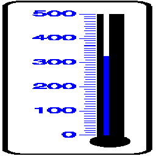

# Temperature Reading Prediction

### Model Architectures
1. **Small_CNN:** _Conv(5, 5, 64)_ -> _Conv(3, 3, 64)_ -> _Conv(3, 3, 128)_ -> _Conv(3, 3, 256)_ -> _Conv(3, 3, 512)_ -> _Conv(3, 3, 512)_ -> _Linear(8192, 101)_
                  During all convolutions, the input is zero padded to make input-output spatial dimensions same and stride is 1. 
                  Each convolution layer is followed by a Batch Normalization layer, ReLU activation and 2x2 MaxPooling layer.

2. **Large_CNN:** _Conv(5, 5, 32)_ -> _Conv(3, 3, 64)_ -> _Conv(3, 3, 128)_ -> _Conv(3, 3, 256)_ -> _Conv(3, 3, 512)_ -> _Conv(3, 3, 512)_ -> _Linear(524288, 101)_
                  During all convolutions, the input is zero padded to make input-output spatial dimensions same and stride is 1. 
                  Each convolution layer is followed by a Batch Normalization layer, ReLU activation. 2x2 MaxPooling layer is added after every 2 
                  convolution layers.

The Adam optimizer with a learning rate of 1e-3 and default values of beta is used. Batch size of 32 is used during training.

### Data Pre-Processing
Input images are resized to 256 x 256 dimensions using bilinear interpolation.

### Loss Function Used
The loss function used is the Cross Entropy Loss. The problem is framed as a 101 class (0, 1, 2, . . ., 100) classification problem.
For the **Small_CNN** model the MSE Loss is also tried. In this case the problem is framed as a regression problem.

### Metric Used
The accuracy is used as the metric for the problem. When doing classification, taking the argmax of the models predictions gives the predicted class.
During regression, the models prediction is calculated by rounding the model output to the nearest integer.

### Results

All results are averaged over 3 random seeds.

Small CNN Training Curve

Large CNN Training Curve

Small CNN with MSE Training Curve

Final Accuracy on Validation Set (Averaged over 3 seeds)

|       | Small CNN | Large CNN | Small CNN MSE |
|:-----:|:---------:|:---------:|:-------------:|
|  Mean |   91.99   |   30.10   |     44.68     |
| Error |  +/- 0.32 | +/- 12.71 |   +/- 30.63   |

Final Accuracy on Test Set (Averaged over 3 seeds)
|       | Small CNN | Large CNN | Small CNN MSE |
|:-----:|:---------:|:---------:|:-------------:|
|  Mean |   91.86   |   30.63   |     43.78     |
| Error |  +/- 0.93 | +/- 13.68 |   +/- 30.08   |

### Visualizations of Results

**Small CNN**

Correct Results

|       |  |  |  |
|:-----:|:---------:|:---------:|:-------------:|
| Prediction |   34   |   47  |     70    |
| Ground Truth | 34 | 47 |   70   |

Incorrect Results

|       |  |  |  |
|:-----:|:---------:|:---------:|:-------------:|
| Prediction |   22   |   65  |     76    |
| Ground Truth | 20 | 64 |   77   |

**Large CNN**

Correct Results

|       |  |  |  |
|:-----:|:---------:|:---------:|:-------------:|
| Prediction |   26   |   45  |     50    |
| Ground Truth | 26 | 45 |   50   |

Incorrect Results

|       |  |  |  |
|:-----:|:---------:|:---------:|:-------------:|
| Prediction |   51   |   56  |     85    |
| Ground Truth | 36 | 55 |   84   |

### Discussion
From the results we notice that when the model makes an error, it is not much far from the ground truth. In fact, the difference is so small it is not easy to distinguish by human inspection. The Smaller model performs better. This could be due to the smaller dataset size which can cause the larger model to overfit. Furthermore, the models were only trained for 10 epochs. This may not have been enough to fully converge the larger model. A future next step is to try data augmentation. Some augmentations that could be useful are vertical flipping and grayscaling the image. Another extension can be to use an off-the shelf digit detector to detect the minimum and maximum readings of the thermometers. This can be used as input to the model and will help provide more information.
